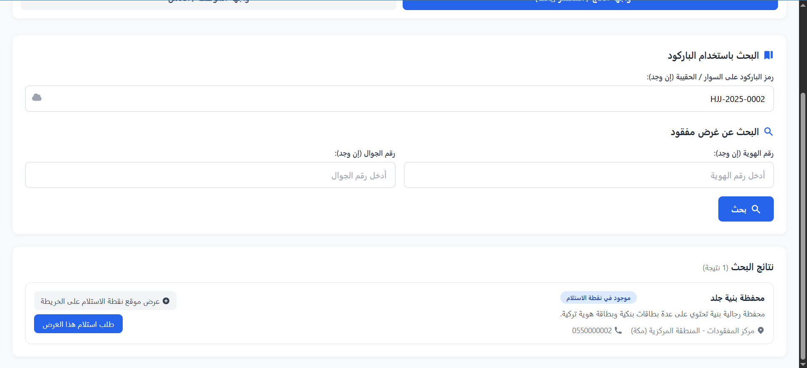
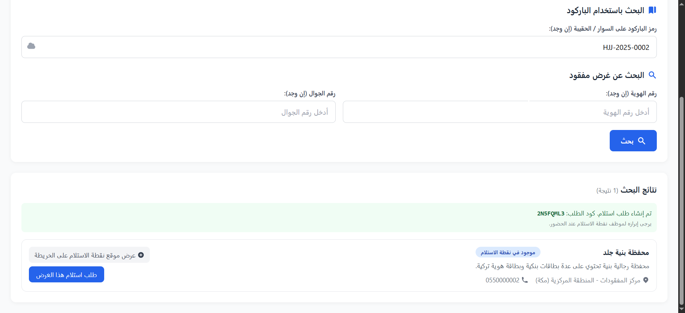
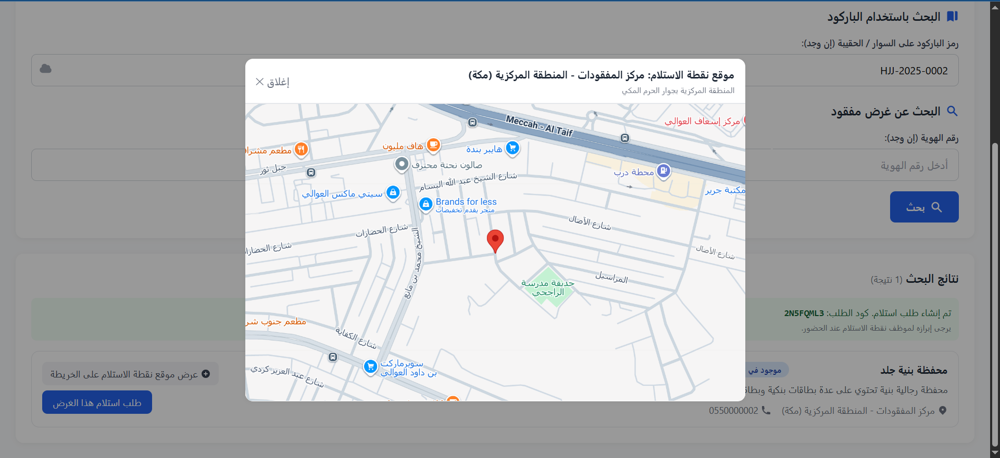
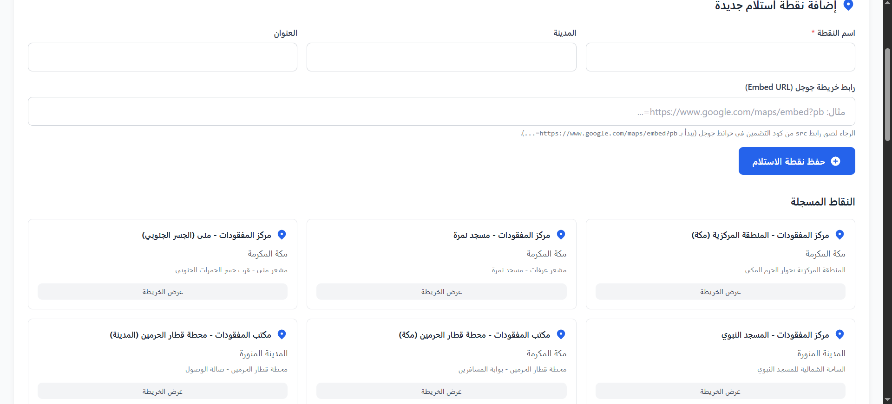
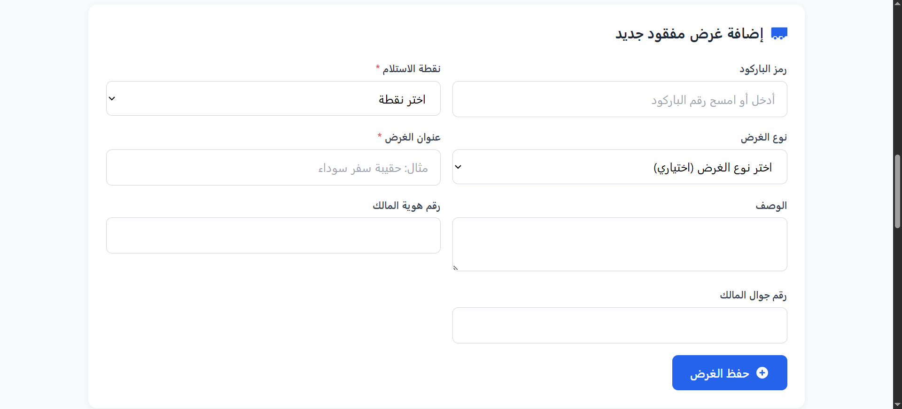
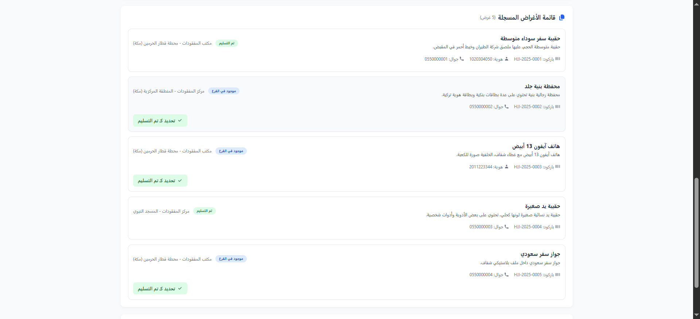
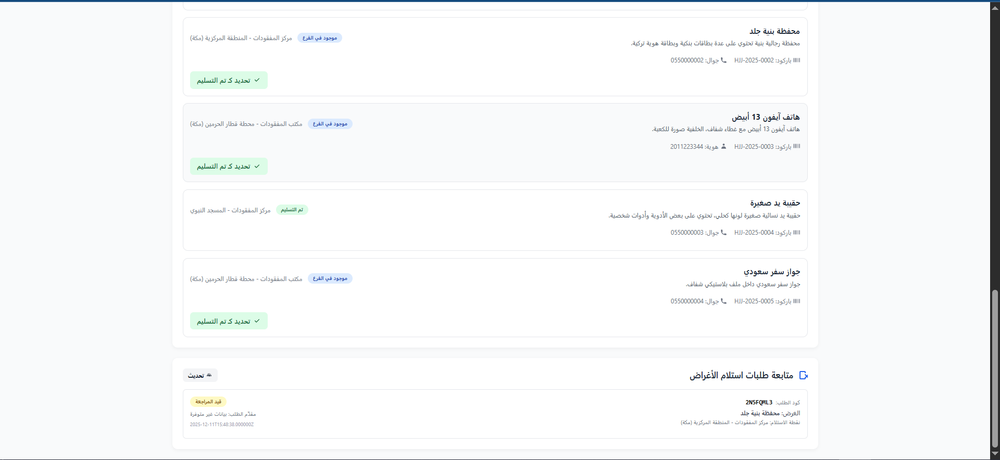

# نظام إدارة الأغراض المفقودة للحجاج والمعتمرين (Lost & Found Prototype)

نظام تجريبي (Prototype) لتسجيل الأغراض المفقودة في نقاط استلام محددة (في مكة والمدينة مثلًا)،  
وإتاحة واجهة سهلة للحاج/المعتمر للبحث عن غرضه المفقود باستخدام **الباركود** أو **رقم الجوال**،  
مع وجود واجهة خاصة بالأدمن لإدارة النقاط والأغراض وطلبات الاستلام.

---

## 🧑‍🏫 الفكرة العامة

1. عند تسجيل الحاج/المعتمر يتم ربطه بسوار أو بطاقة تحتوي على **باركود**.
2. عند العثور على غرض ضائع:
   - الموظف في نقطة الاستلام يسجّل الغرض ويحدد النقطة.
   - يمكن ربط الغرض ببيانات صاحب الغرض (جوال / هوية) إن توفرت.
3. صاحب الغرض الضائع يدخل على واجهة البحث:
   - إمّا يكتب رقم الباركود الموجود على السوار/الحقيبة.
   - أو يبحث برقم جواله.
4. في حال إيجاد الغرض:
   - يقدّم **طلب استلام إلكتروني (Claim Request)**.
   - يظهر له **كود طلب استلام** يقدمه للموظف عند الحضور للنقطة.
   - يمكنه عرض **موقع نقطة الاستلام على الخريطة** (Google Maps Embed).
5. الأدمن يملك لوحة بسيطة:
   - إدارة نقاط الاستلام.
   - تسجيل الأغراض المفقودة.
   - متابعة جميع الأغراض وطلبات الاستلام وحالاتها.

---

## 🛠️ التقنيات المستخدمة

- **Laravel**  
  API بسيطة للأغراض، النقاط، وطلبات الاستلام.
- **Vue 3 via CDN**  
  لواجهة المستخدم في صفحة واحدة (Single Page Prototype).
- **Tailwind CSS**  
  لتنسيق الواجهة بشكل سريع وعصري.
- **Google Maps Embed**  
  لعرض موقع نقطة الاستلام على الخريطة.
- *(مستقبلاً)* التكامل مع **SMS Gateway** لإرسال رسائل لصاحب الغرض.

---

## 🧭 تدفّق الاستخدام (User Flow)

### 1️⃣ واجهة صاحب الغرض الضائع – البحث

في هذه الشاشة يمكن لصاحب الغرض أن:

- يدخل **رمز الباركود** الموجود على:
  - السوار
  - الحقيبة
  - أو أي ملصق مرتبط به.
- أو يبحث باستخدام **رقم الجوال** (إن تم تسجيله سابقًا).

> صورة:  
> 

---

### 2️⃣ ظهور نتيجة البحث + طلب الاستلام

بعد الضغط على زر **بحث**:

- تظهر بطاقة الغرض إن وُجدت.
- تظهر **حالة الغرض** (مثلاً: موجود في نقطة الاستلام).
- زر **طلب استلام هذا الغرض**:
  - ينشئ **كود طلب استلام** مثل: `2NSFQML3`.
  - هذا الكود يقدمه صاحب الغرض للموظف عند الحضور.
  - _مستقبلاً:_ يتم إرسال **SMS** لصاحب الغرض يحتوي:
    - كود الطلب
    - اسم نقطة الاستلام.
- زر **عرض موقع نقطة الاستلام على الخريطة**:
  - يفتح نافذة خريطة بنقطة تحديد موقع المركز.

> صورة:  
> 

---

### 3️⃣ عرض موقع نقطة الاستلام على الخريطة

- تظهر نافذة (Modal) فيها **Google Maps Embed**.
- يتم عرض موقع نقطة الاستلام (مثل: مركز المفقودات – المنطقة المركزية بمكة).
- تساعد الحاج/المعتمر للوصول لموقع النقطة بسهولة.

> صورة:  
> 

---

## 🧑‍💼 واجهة الأدمن / الموظف

### 4️⃣ إضافة نقاط الاستلام

- نموذج لإضافة **نقطة استلام جديدة** يحتوي على:
  - اسم النقطة.
  - المدينة.
  - العنوان.
  - رابط خريطة Google Maps (Embed URL) لعرضها في الواجهة.
- أسفل النموذج تظهر جميع **النقاط المسجّلة** كبطاقات.

> صورة:  
> 

---

### 5️⃣ تسجيل واستقبال الأغراض المفقودة

في هذه الشاشة يمكن للأدمن:

- تسجيل غرض مفقود جديد:
  - اختيار نقطة الاستلام.
  - اختيار نوع الغرض (مثلاً: حقيبة، هاتف، جواز).
  - إدخال عنوان ووصف الغرض.
  - ربط رقم الهوية ورقم الجوال بصاحب الغرض (إن وُجد).
- عند وجود بيانات تواصل:
  - _مستقبلاً:_ عند تسجيل الغرض يتم إرسال **SMS** لصاحب الغرض:
    - تخبره بأن غرضه موجود في نقطة معينة.

> صورة:  
> 

---

### 6️⃣ قائمة الأغراض المفقودة + حالات التسليم

في هذه الشاشات يمكن للأدمن:

- عرض قائمة كاملة لكل الأغراض المسجّلة.
- لكل غرض تظهر البيانات التالية:
  - عنوان الغرض.
  - وصف مختصر.
  - نقطة الاستلام.
  - رقم الجوال / الهوية إن وُجدت.
  - حالة الغرض:
    - **موجود في الفرع**.
    - **تم التسليم**.
- زر **تحديد كـ تم التسليم**:
  - يغيّر حالة الغرض عند استلامه من صاحبه.
- قسم **متابعة طلبات استلام الأغراض**:
  - يعرض آخر طلبات الاستلام مع:
    - كود الطلب.
    - وصف الغرض.
    - نقطة الاستلام.
    - حالة الطلب (قيد المراجعة / مقبول / مرفوض).

> صور:  
>   
> 

---

## 📌 ملاحظات مستقبلية (To-Do)

- ربط فعلي مع **بوابة SMS**:
  - عند تسجيل غرض جديد مع رقم جوال.
  - عند إنشاء طلب استلام جديد.
- بناء لوحة تحكم كاملة داخل Laravel (Blade أو Vue SPA).
- إضافة:
  - صلاحيات مستخدمين (موظف – مشرف – مدير عام).
  - تقارير إحصائية عن عدد الأغراض والطلبات.
  - دعم لغات متعددة (عربي / إنجليزي).

---
